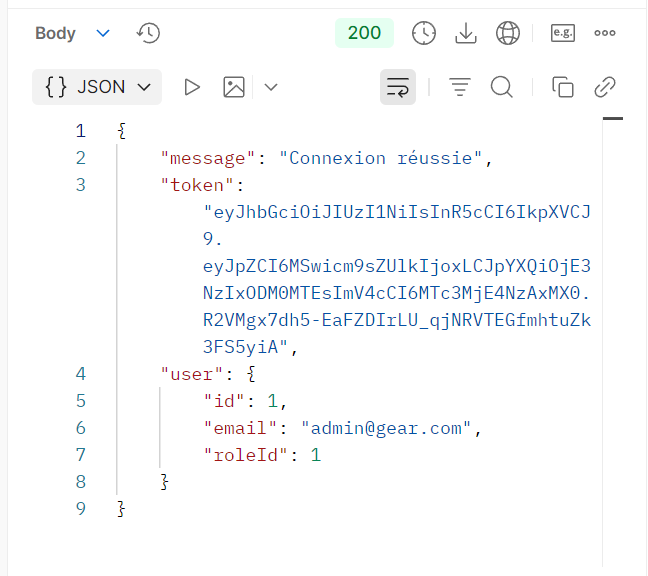
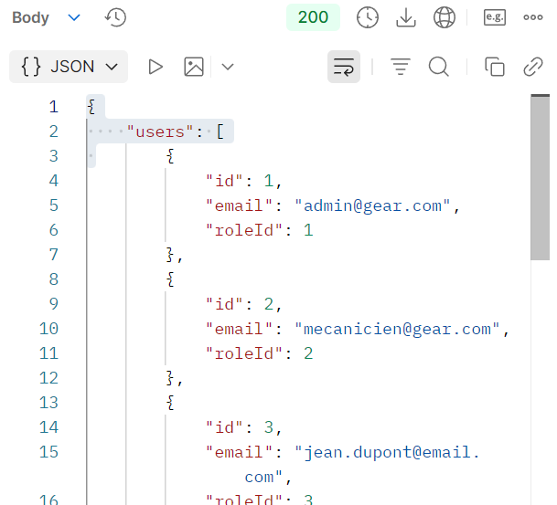
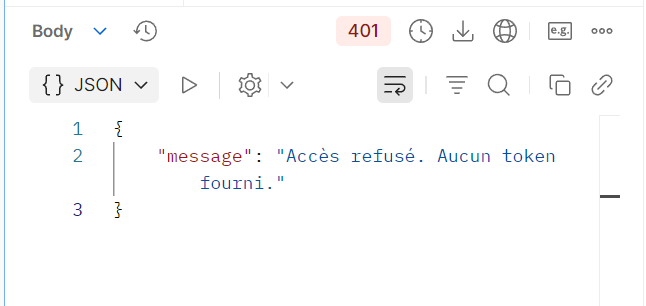

# GearStack - Workshop Management System

**GearStack** is a full-stack application designed for automotive workshops. It allows **Mechanics** to manage vehicle interventions and **Clients** to track their car's repair history in real-time through a "Virtual Garage".

## Tech Stack
* **Backend**: Node.js & Express.
* **ORM**: **Sequelize** (Object-Relational Mapping).
* **Database**: **MariaDB**.
* **Frontend**: React (Vite), **Tailwind CSS** (v4), and **daisyUI** (Component Library).


## Requirements
Before running the project, ensure you have the following installed:
* **Node.js** (v16 or higher recommended).
* **MariaDB** (Database server).


## Project Structure
This repository is organized as a **monorepo**:
* **/server**: Node.js + Express API + **Sequelize Models**.
* **/client**: React + Vite application.


## Installation and Execution

### 1. Database Configuration
1. Ensure your **MariaDB** server is running.
2. Create a database named `gearmanager` (or the name specified in your `.env`).
3. The tables will be automatically synchronized by **Sequelize** upon server startup.

### 2. Backend Setup (`/server`)
1. **Open a terminal** and navigate to the folder:

   ```bash
   cd server
   ```

2. **Install dependencies**:

   ```bash
   npm install
   ```

3. **Run the server**:

   ```bash
   npm start
   ```
   > *Note: The server runs on `http://localhost:3000`.*

### 3. Frontend Setup (`/client`)
1. **Open a NEW terminal** and navigate to:

   ```bash
   cd client
   ```

2. **Install dependencies**:

   ```bash
   npm install
   ```

3. **Run the dashboard**:

   ```bash
   npm run dev
   ```
   > *Note: The application will open at `http://localhost:5173`.*
   
## Access Control & Demo Environment

To properly test the **Role-Based Access Control (RBAC)**, it is highly recommended to initialize the database with our seed script located in the server folder. This ensures that all roles, permissions, and test users are correctly configured in your local MariaDB instance.

### Database Initialization
Navigate to the `/server` directory and run the following command to populate the database:

```bash
npm run seed
```

### User Roles & Credentials
The application features three distinct access levels. Below is a description of each role's capabilities and the credentials you can use to log in:

| Role | Permissions & Capabilities | Demo Credentials (Email / Password) |
| :--- | :--- | :--- |
| **Admin** (ID: 1) | **Full Access**: Can manage all system users, view global workshop logs, and register/manage Mechanic accounts. | `admin@gear.com` / `123456` |
| **Mechanic** (ID: 2) | **Operational Access**: Can search for vehicles by plate, create and edit repair entries, and update intervention statuses. | `mecanicien@gear.com` / `123456` |
| **Client** (ID: 3) | **Personal Access**: Can register their own vehicles, view their virtual garage, and track real-time repair history. | `jean.dupont@email.com` / `123456` |


## API Security & RBAC Verification
**JSON Web Tokens (JWT)** and **Role-Based Access Control (RBAC)** are utilized to secure the endpoints. Below are the test cases performed in Postman to verify that the security middlewares (`authmiddleware` and `rolemiddleware`) are functioning correctly.

### 1. User Authentication (Login)
Before accessing protected routes, users must authenticate to receive a unique JWT.
* **Endpoint**: `POST /api/auth/login`
* **Result**: `200 OK` - A valid token is generated for the session.



### 2. Authorized Access (Admin Role)
An administrator with the correct permissions can access sensitive data, such as the complete list of users.
* **Endpoint**: `GET /api/auth/users-list`
* **Identity**: Admin Token
* **Result**: `200 OK` - Access granted by `rolemiddleware`.



### 3. Forbidden Access (Insufficient Permissions)
This test demonstrates our **RBAC** logic. A user (e.g., a Mechanic) is logged in but attempts to access a route reserved for Admins.
* **Endpoint**: `GET /api/auth/users-list`
* **Identity**: Mechanic Token
* **Result**: `403 Forbidden` - "Accès refusé: Permission insuffisante."


### 4. Unauthenticated Access (No Token)
This test verifies that our `authmiddleware` blocks any request that does not include a security header.
* **Endpoint**: `GET /api/auth/users-list`
* **Identity**: Guest (No Token)
* **Result**: `401 Unauthorized` - "Accès refusé. Aucun token fourni."



## Key Commands Summary

| Action | Directory | Command |
| :--- | :--- | :--- |
| **Start Backend** | `/server` | `npm start` |
| **Start Frontend** | `/client` | `npm run dev` |
| **Install Dependencies** | Both | `npm install` |

## Key Features
* **Admin Dashboard**: Full user management system to view all registered users and the ability to add new Mechanics to the workshop.
* **Mechanic Dashboard**: Search vehicles by license plate, assign repairs to cars, and manage repair statuses (open or mark as completed).
* **Client Dashboard**: Register owned vehicles, check their real-time status, and view detailed maintenance history.
* **Security**: Role-Based Access Control (RBAC) and password hashing with Bcrypt.
* **Modern UI**: Fully responsive and themed interface built with **Tailwind CSS** and **daisyUI**.
